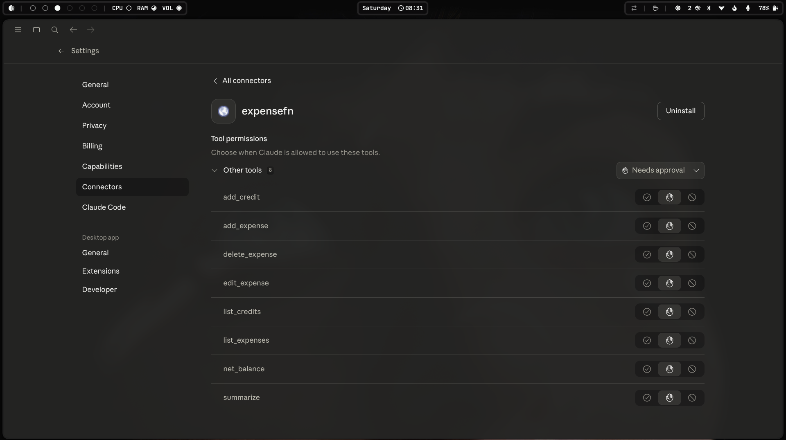
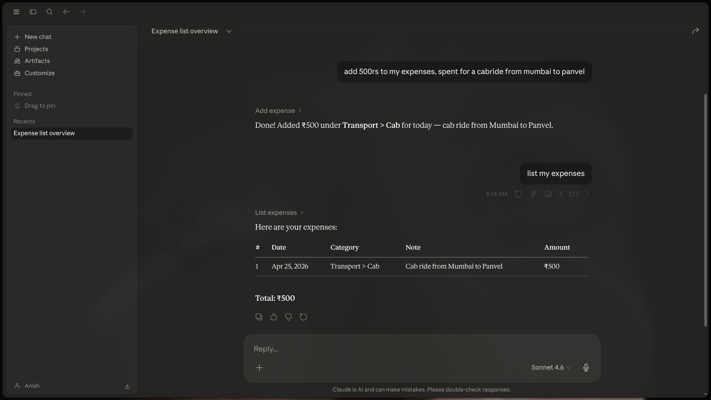

# ExpenseFN

ExpenseFN is a lightweight MCP (Model Context Protocol) server for tracking expenses and credits using SQLite, designed for seamless integration with AI clients like Claude.

It supports both **local execution** and **remote MCP deployment**.

---

## Features

* Expense tracking with category and subcategory support
* Credit (income) tracking with clean separation from expenses
* Date-range queries for expenses and credits
* Net balance calculation (credits - expenses)
* Expense editing and deletion
* Category-wise summaries
* MCP-compatible tool interface
* Remote MCP deployment support

---

## Remote MCP Endpoint

ExpenseFN is deployed and accessible remotely via:

```
https://expensefn.fastmcp.app/mcp
```

---

## Using with Claude Desktop (Remote MCP)

Follow these steps to connect ExpenseFN to Claude Desktop:

1. Open Claude Desktop
2. Go to **Settings**
3. Navigate to **Connectors**
4. Click **Add Connector**
5. Paste the MCP URL:

```
https://expensefn.fastmcp.app/mcp
```
---




## Project Structure

```
expense-mcp/
├── __pycache__/
├── .venv/
├── .gitignore
├── .python-version
├── categories.json
├── expenses.db
├── main.py
├── pyproject.toml
├── README.md
└── uv.lock
```

---

## MCP Tools

* add_expense
* add_credit
* list_expenses
* list_credits
* edit_expense
* delete_expense
* net_balance
* summarize

---

## MCP Resource

```
expense://categories
```

Provides category definitions from `categories.json`.

---

## Design Notes

* Separate tables for expenses and credits ensure clean accounting
* SQLite provides zero-configuration local persistence
* Minimal schema for easy extension
* Built specifically for MCP-based AI workflows

---

## Future Improvements

* Recurring transactions
* Budget tracking and alerts
* CSV export
* Multi-user support
* Advanced filtering

---

## License

MIT License
